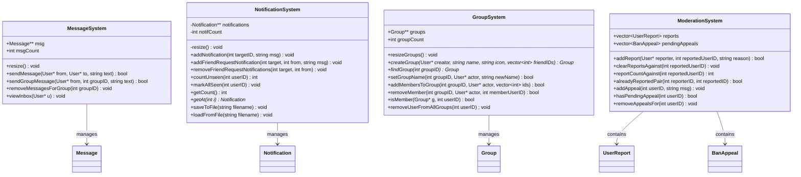
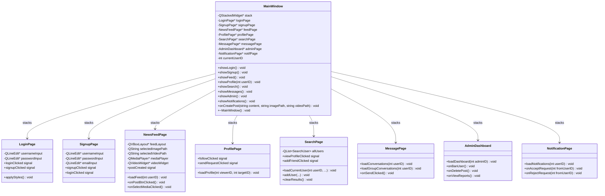

# ARCHITECTURE.md — Connectify System Architecture

## Overview

Connectify is built on a **strict three-layer architecture**. No layer may depend on a layer above it. This design separates domain logic, business logic, and presentation into independent, testable units.

```
┌────────────────────────────────────────────────────┐
│                  UI Layer (Qt6)                    │
│  MainWindow · 8 Pages · 2 Widgets · Session        │
│  LoginPage · SignupPage · NewsFeedPage ·           │
│  ProfilePage · MessagePage · SearchPage ·          │
│  NotificationPage · AdminDashboard                 │
├────────────────────────────────────────────────────┤
│           Manager / Business Logic Layer           │
│  AuthManager · FileManager · NewsFeed ·            │
│  FriendGraph · MessageSystem ·                     │
│  NotificationSystem · SearchEngine · GroupSystem   │
├────────────────────────────────────────────────────┤
│               Model Layer (Pure C++)               │
│  User · NormalUser · Admin · Post · Message ·      │
│  Notification · Group · Custom Data Structures     │
└────────────────────────────────────────────────────┘
```

**Core Rule:** Models know nothing about managers. Managers know nothing about Qt. The UI knows about both but never bypasses the manager layer.

---

## Layer 1 — Model Layer

All domain classes live here. They have **zero Qt dependency** and **zero STL containers**.

### Class Hierarchy

```
User  (base class — virtual destructor)
├── NormalUser     role = "user"
└── Admin          role = "admin"

Post  (standalone — linked list node)
└── (TextPost / ImagePost variants planned for v2)

Message            (value object)
Notification       (value object with seen/unseen state)
Group              (group chat entity)
```

### Key Model: `User`

The `User` class is the heart of the application. It holds:

| Field              | Type     | Purpose                          |
| ------------------ | -------- | -------------------------------- |
| `userID`           | `int`    | Unique identifier                |
| `userName`         | `string` | Display name                     |
| `password`         | `string` | Stored credential                |
| `role`             | `string` | `"user"` or `"admin"`            |
| `email`            | `string` | Contact / login                  |
| `isBanned`         | `bool`   | Admin-controlled ban flag        |
| `birthDate`        | `string` | Profile information              |
| `githubUsername`   | `string` | Profile link                     |
| `profileImagePath` | `string` | Avatar image path                |
| `friends`          | `User**` | Dynamic array of friend pointers |
| `request`          | `User**` | Pending friend requests          |
| `follower`         | `User**` | Users following this user        |
| `following`        | `User**` | Users this user follows          |
| `posts`            | `Post**` | Dynamic array of post pointers   |

The `User` class implements:

- Custom copy constructor (deep copy of pointer arrays)
- Copy assignment operator (`operator=`)
- Virtual destructor (proper cleanup of all dynamic arrays)
- `resize()` and `resizePosts()` for dynamic array growth

---

## Layer 2 — Manager Layer

Managers implement business rules. They are independent of Qt and interact with models only.

### `NotificationSystem`

Manages a dynamic array of `Notification*` objects. Provides:

- `addNotification(targetID, message)` — append a new notification
- `addFriendRequestNotification(targetID, fromID, message)` — typed notification
- `removeFriendRequestNotifications(targetID, fromID)` — cleanup on rejection
- `showNotifications(userID, userName)` — console display
- `countUnseen(userID)` — badge count for UI
- `markAllSeen(userID)` — mark all as read
- `saveToFile()` / `loadFromFile()` — persistence

### `MessageSystem`

Manages a dynamic array of `Message*` objects with full resize logic:

- `sendMessage(from, to, text)` — create and store message
- `sendGroupMessage(from, groupID, text)` — group chat support
- `viewInbox(user)` — console display of conversations
- `removeMessagesForGroup(groupID)` — group cleanup

### `GroupSystem`

Manages group chats:

- `createGroup(creator, name, iconPath, friendIDs)` — create a new group
- `findGroup(groupID)` — lookup
- `setGroupName(groupID, actor, newName)` — rename (creator only)
- `addMembersToGroup(groupID, actor, friendIDs)` — extend group
- `removeMember(groupID, actor, memberID)` — remove member

### `SearchEngine` (stateless)

- `searchUsers(keyword)` — linear scan of all usernames
- `searchPosts(keyword)` — linear scan of all post contents

---

## 2. Class Diagram — Core Data Model

<<<<<<< HEAD
Built entirely with **Qt6 Widgets**. No business logic lives here — all actions go through the manager layer.

### Navigation Model

A single `QStackedWidget` in `MainWindow` holds all pages. Navigation is done by switching the active widget index.

```
MainWindow (QMainWindow)
└── QStackedWidget (stack)
    ├── LoginPage
    ├── SignupPage
    ├── NewsFeedPage
    ├── ProfilePage
    ├── SearchPage
    ├── MessagePage
    ├── NotificationPage
    └── AdminDashboard
```

### Page Descriptions

| Page               | File                              | Responsibility                                             |
| ------------------ | --------------------------------- | ---------------------------------------------------------- |
| `LoginPage`        | `frontend/pages/LoginPage`        | Username + password form, login signal                     |
| `SignupPage`       | `frontend/pages/SignupPage`       | Registration form with validation                          |
| `NewsFeedPage`     | `frontend/pages/newsfeedpage`     | Post feed, compose post, like, comment                     |
| `ProfilePage`      | `frontend/pages/profilepage`      | View/edit user profile, posts list                         |
| `SearchPage`       | `frontend/pages/searchpage`       | Search users and posts by keyword                          |
| `MessagePage`      | `frontend/pages/messagepage`      | Inbox, conversations, group chats                          |
| `NotificationPage` | `frontend/pages/notificationpage` | Notification list, mark-all-read                           |
| `AdminDashboard`   | `frontend/pages/admindashboard`   | Stats panel, user table, post moderation, reports, appeals |

### Integration Header

`frontend/integration/mainwindow_integration.h` serves as the **wiring document** for all inter-page signals and slots. It declares:

- All page pointers as members
- All navigation slots (`showLogin()`, `showSignup()`, `showNewsFeed()`, etc.)
- All action slots (`onLoginClicked()`, `onCreatePost()`, `onLikePost()`, etc.)
- Extern references to global backend state (`users`, `userCount`, `nextID`, `msgSystem`, `notifSystem`)

---

## Data Flow — Login Example

````
User types credentials in LoginPage
        │
        ▼ (signal: loginClicked(username, password))
MainWindow::onLoginClicked()
        │
        ▼ calls backend
login(username, password)          ← backend/src/user.cpp
        │
        ▼ returns index
m_loggedInIndex = result
        │
        ▼
if role == "admin" → showAdminDashboard()
else               → showNewsFeed()
        │
        ▼
feedPage->refresh(users[m_loggedInIndex])
=======
```mermaid
classDiagram
    class Post {
        +int postID
        +string content
        +string imagePath
        +string videoPath
        +int likeCount
        +vector~int~ likedBy
        +string comments[50]
        +int commentCount
        +Post* next
        +time_t timestamp
        +toggleLike(int userID) bool
        +hasLiked(int userID) bool
        +addComment(string c) void
        +display() void
    }

    class User {
        +int userID
        +string password
        +string userName
        +string role
        +bool isBanned
        +string birthDate
        +string githubUsername
        +string email
        +string profileImagePath
        +User** friends
        +int friendCount
        +User** request
        +int requestCount
        +User** follower
        +int followerCount
        +User** following
        +int followingCount
        +Post** posts
        +int postCount
        +sendRequest(User* u) bool
        +follow(User* to) void
        +acceptRequest(User* u) void
        +rejectRequest(User* u) void
        +createPost(Post* p) void
        +deletePost(int postID) bool
        +resize(User**& u, int count) void
        +resizePosts(Post**& p, int count) void
    }

    class NormalUser {
        +NormalUser()
        +NormalUser(int id, string username, string pass, string em)
    }

    class Admin {
        +Admin()
        +Admin(int id, string username, string pass, string em)
    }

    class Message {
        +int senderID
        +int receiverID
        +string text
        +time_t timestamp
    }

    class Group {
        +int groupID
        +string name
        +string iconPath
        +int creatorID
        +vector~int~ memberIDs
    }

    class Notification {
        +int targetUserID
        +string message
        +time_t timestamp
        +bool seen
        +int kind
        +int relatedUserID
    }

    class UserReport {
        +int reporterID
        +int reportedID
        +string reason
        +time_t timestamp
    }

    class BanAppeal {
        +int userID
        +string message
        +time_t timestamp
    }

    User <|-- NormalUser : inherits
    User <|-- Admin : inherits
    User "1" o-- "0..*" Post : owns (Post**)
    User "1" o-- "0..*" User : friends / followers (User**)
    Message --> User : senderID / receiverID
    Group --> User : creatorID + memberIDs
    Notification --> User : targetUserID
    UserReport --> User : reporterID / reportedID
    BanAppeal --> User : userID
>>>>>>> a916aaa8142b9ff808c77acbad73a0cc484c3bc0
````

---

<<<<<<< HEAD

## Data Persistence Flow

```
App Startup → loadData()          [reads data.json → populates users[], posts, relations]
                                  [reads notifications.txt → populates notifSystem]

App Shutdown → saveData()         [serializes all in-memory state → writes data.json]
                                  [saves notifSystem → writes notifications.txt]
```

All data is stored in:

- `data.json` — users, posts, messages, groups, relations, reports, appeals
- `notifications.txt` — notification records

---

## Build System

The project uses **CMake 3.23+** with three build presets:

| Preset           | Generator             | Output Directory     |
| ---------------- | --------------------- | -------------------- |
| `qt-debug`       | Ninja                 | `build-qt-debug/`    |
| `qt-mingw-debug` | MinGW Makefiles       | `build-mingw-debug/` |
| `msvc-debug`     | Visual Studio 18 2026 | `build-msvc-debug/`  |

The CMakeLists.txt uses `GLOB_RECURSE` to automatically pick up all `.cpp` files — no manual registration needed when adding new source files.

Include directories exposed to all targets:

- `backend/include` — for `user.h` (also passed to MOC)
- `backend` — for backend source includes
- `frontend/pages` — for page headers
- `frontend/integration` — for the integration header

# Linked libraries: `Qt6::Widgets`

## 3. Class Diagram — System Managers



---

## 4. Class Diagram — Frontend (Qt Pages)



---

## 5. Data Flow — Login Sequence

```
User types credentials
        │
        ▼
LoginPage::onLoginClicked()
        │ emit loginClicked(username, password)
        ▼
MainWindow::onLoginClicked(username, password)
        │ calls login(username, password)  [user.cpp]
        ▼
int login(string u, string pass)
        │ iterates users[], compares userName + password
        │ returns userID  (or -1 if fail)
        ▼
MainWindow stores currentUserID
        │ calls showFeed()
        ▼
NewsFeedPage::loadFeed(currentUserID)
        │ iterates users[i]->following for the current user
        │ renders FeedPostCard for each Post*
        ▼
UI displays news feed
```

---

## 6. Data Flow — Post Creation Sequence

```
User types content, optionally selects image/video
        │
        ▼
NewsFeedPage::onPostBtnClicked()
        │ validates: content OR media must be non-empty
        │ emit postCreated(content, imagePath, videoPath)
        ▼
MainWindow::onCreatePost(content, imagePath, videoPath)
        │ finds User* me = users[currentUserID]
        │ creates Post* p = new Post(nextPostID++, content, imagePath, videoPath)
        │ calls me->createPost(p)
        ▼
User::createPost(Post* p)
        │ calls resizePosts(posts, postCount)
        │ posts[postCount++] = p
        ▼
MainWindow::saveData()  (called on exit)
        │ serializes all users, posts, relationships to data.json
        ▼
data.json updated on disk
```

---

## 7. Data Flow — Friend Request Sequence

```
User A clicks "+ Add Friend" on User B's profile
        │
        ▼
SearchPage / ProfilePage emits addFriendClicked(userBID)
        │
        ▼
MainWindow::onAddFriend(userBID)
        │ finds User* a = users[currentUserID]
        │ finds User* b = findUser(userBID)
        │ calls a->sendRequest(b)
        ▼
User::sendRequest(User* u)
        │ resizes request array of target user u
        │ u->request[u->requestCount++] = this
        │ calls notifSystem.addFriendRequestNotification(u->userID, this->userID, ...)
        ▼
User B logs in → NotificationPage::loadNotifications()
        │ shows pending friend request
        │ User B clicks Accept
        ▼
MainWindow::onAcceptFriendRequest(userAID)
        │ finds both users
        │ calls b->acceptRequest(a)
        ▼
User::acceptRequest(User* u)
        │ adds each to other's friends[] array
        │ removes from request[] array
        │ calls notifSystem.removeFriendRequestNotifications(...)
```

---

## 8. Memory Management Architecture

```
Global Heap
├── User** users[userCount]
│     ├── users[0] → NormalUser { Post** posts[postCount] }
│     │                              ├── posts[0] → Post { comments[50] }
│     │                              └── posts[n] → Post
│     ├── users[1] → Admin { ... }
│     └── users[n] → NormalUser { ... }
│
├── MessageSystem msgSystem
│     └── Message** msg[msgCount]
│
├── NotificationSystem notifSystem
│     └── Notification** notifications[notifCount]
│
└── GroupSystem groupSystem
      └── Group** groups[groupCount]

Cleanup on exit: MainWindow::~MainWindow()
  ├── saveData()          → flush all data to data.json
  └── freeAllData()       → delete all users[i]; delete[] users;
                            (MessageSystem, NotificationSystem, GroupSystem
                             self-clean via their own destructors)
```

---

## 9. OOP Concepts Map

| Concept                | Location           | Example                                                    |
| ---------------------- | ------------------ | ---------------------------------------------------------- |
| **Classes & Objects**  | All backend files  | `Post`, `User`, `Message`, `Group`                         |
| **Inheritance**        | `user.h:175-209`   | `NormalUser : public User`, `Admin : public User`          |
| **Encapsulation**      | All classes        | `password`, `isBanned` accessed only via class methods     |
| **Polymorphism**       | `user.h:140`       | `virtual ~User()` — vtable dispatch on delete              |
| **Abstraction**        | `Post`, `User`     | Uniform `toggleLike()`, `addComment()` hide implementation |
| **Dynamic Memory**     | `user.h:133-137`   | `friends = new User*[1]` with manual `resize()`            |
| **Rule of Three**      | `user.h:152-153`   | Copy ctor + assignment `= delete`                          |
| **Destructors**        | `user.h:140-149`   | Cascading `delete` of owned Post objects                   |
| **File I/O**           | `user.cpp`         | `saveData()` / `loadData()` via `QJsonDocument`            |
| **GUI / Event-Driven** | All frontend files | Qt Signals & Slots replacing callbacks                     |

> > > > > > > a916aaa8142b9ff808c77acbad73a0cc484c3bc0
