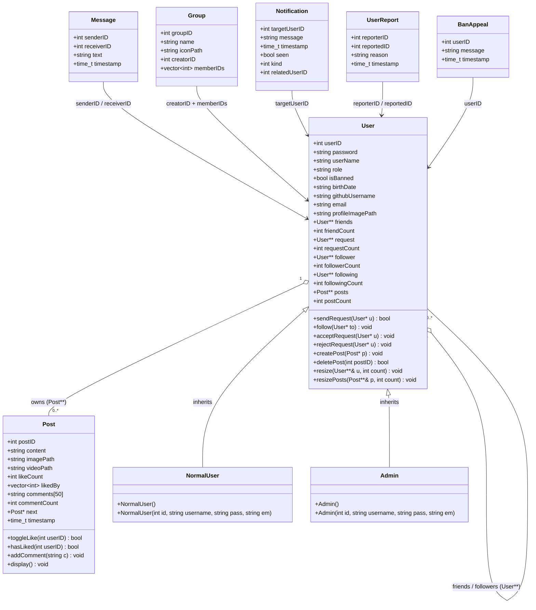

# ARCHITECTURE.md — Connectify System Architecture

> **Course:** Object Oriented Programming | BS Software Engineering  
> **Team Leader:** Ali Abdullah (25L-3022)

---

## 1. System Layer Diagram

```
┌──────────────────────────────────────────────────────────────────────┐
│                        PRESENTATION LAYER (Qt Widgets)               │
│  LoginPage  SignupPage  NewsFeedPage  ProfilePage  SearchPage         │
│  MessagePage  NotificationPage  AdminDashboard  MainWindow (router)  │
└──────────────────────────────────┬───────────────────────────────────┘
                                   │  Qt Signals / Slots
┌──────────────────────────────────▼───────────────────────────────────┐
│                        BUSINESS LOGIC LAYER (C++ Backend)            │
│  User  NormalUser  Admin  Post  Message  Group  Notification         │
│  MessageSystem  NotificationSystem  GroupSystem  ModerationSystem    │
└──────────────────────────────────┬───────────────────────────────────┘
                                   │  saveData() / loadData()
┌──────────────────────────────────▼───────────────────────────────────┐
│                        PERSISTENCE LAYER (JSON File I/O)             │
│  data.json (users, posts, relationships, messages, groups)           │
│  notifications.txt (notification records)                            │
└──────────────────────────────────────────────────────────────────────┘
```

---

## 2. Class Diagram — Core Data Model



---

## 3. Class Diagram — System Managers


---

## 4. Class Diagram — Frontend (Qt Pages)


---

## 5. Data Flow — Login Sequence

```
User types credentials
        │
        ▼
LoginPage::onLoginClicked()
        │ emit loginClicked(username, password)
        ▼
MainWindow::onLoginClicked(username, password)
        │ calls login(username, password)  [user.cpp]
        ▼
int login(string u, string pass)
        │ iterates users[], compares userName + password
        │ returns userID  (or -1 if fail)
        ▼
MainWindow stores currentUserID
        │ calls showFeed()
        ▼
NewsFeedPage::loadFeed(currentUserID)
        │ iterates users[i]->following for the current user
        │ renders FeedPostCard for each Post*
        ▼
UI displays news feed
```

---

## 6. Data Flow — Post Creation Sequence

```
User types content, optionally selects image/video
        │
        ▼
NewsFeedPage::onPostBtnClicked()
        │ validates: content OR media must be non-empty
        │ emit postCreated(content, imagePath, videoPath)
        ▼
MainWindow::onCreatePost(content, imagePath, videoPath)
        │ finds User* me = users[currentUserID]
        │ creates Post* p = new Post(nextPostID++, content, imagePath, videoPath)
        │ calls me->createPost(p)
        ▼
User::createPost(Post* p)
        │ calls resizePosts(posts, postCount)
        │ posts[postCount++] = p
        ▼
MainWindow::saveData()  (called on exit)
        │ serializes all users, posts, relationships to data.json
        ▼
data.json updated on disk
```

---

## 7. Data Flow — Friend Request Sequence

```
User A clicks "+ Add Friend" on User B's profile
        │
        ▼
SearchPage / ProfilePage emits addFriendClicked(userBID)
        │
        ▼
MainWindow::onAddFriend(userBID)
        │ finds User* a = users[currentUserID]
        │ finds User* b = findUser(userBID)
        │ calls a->sendRequest(b)
        ▼
User::sendRequest(User* u)
        │ resizes request array of target user u
        │ u->request[u->requestCount++] = this
        │ calls notifSystem.addFriendRequestNotification(u->userID, this->userID, ...)
        ▼
User B logs in → NotificationPage::loadNotifications()
        │ shows pending friend request
        │ User B clicks Accept
        ▼
MainWindow::onAcceptFriendRequest(userAID)
        │ finds both users
        │ calls b->acceptRequest(a)
        ▼
User::acceptRequest(User* u)
        │ adds each to other's friends[] array
        │ removes from request[] array
        │ calls notifSystem.removeFriendRequestNotifications(...)
```

---

## 8. Memory Management Architecture

```
Global Heap
├── User** users[userCount]
│     ├── users[0] → NormalUser { Post** posts[postCount] }
│     │                              ├── posts[0] → Post { comments[50] }
│     │                              └── posts[n] → Post
│     ├── users[1] → Admin { ... }
│     └── users[n] → NormalUser { ... }
│
├── MessageSystem msgSystem
│     └── Message** msg[msgCount]
│
├── NotificationSystem notifSystem
│     └── Notification** notifications[notifCount]
│
└── GroupSystem groupSystem
      └── Group** groups[groupCount]

Cleanup on exit: MainWindow::~MainWindow()
  ├── saveData()          → flush all data to data.json
  └── freeAllData()       → delete all users[i]; delete[] users;
                            (MessageSystem, NotificationSystem, GroupSystem
                             self-clean via their own destructors)
```

---

## 9. OOP Concepts Map

| Concept | Location | Example |
|---|---|---|
| **Classes & Objects** | All backend files | `Post`, `User`, `Message`, `Group` |
| **Inheritance** | `user.h:175-209` | `NormalUser : public User`, `Admin : public User` |
| **Encapsulation** | All classes | `password`, `isBanned` accessed only via class methods |
| **Polymorphism** | `user.h:140` | `virtual ~User()` — vtable dispatch on delete |
| **Abstraction** | `Post`, `User` | Uniform `toggleLike()`, `addComment()` hide implementation |
| **Dynamic Memory** | `user.h:133-137` | `friends = new User*[1]` with manual `resize()` |
| **Rule of Three** | `user.h:152-153` | Copy ctor + assignment `= delete` |
| **Destructors** | `user.h:140-149` | Cascading `delete` of owned Post objects |
| **File I/O** | `user.cpp` | `saveData()` / `loadData()` via `QJsonDocument` |
| **GUI / Event-Driven** | All frontend files | Qt Signals & Slots replacing callbacks |
